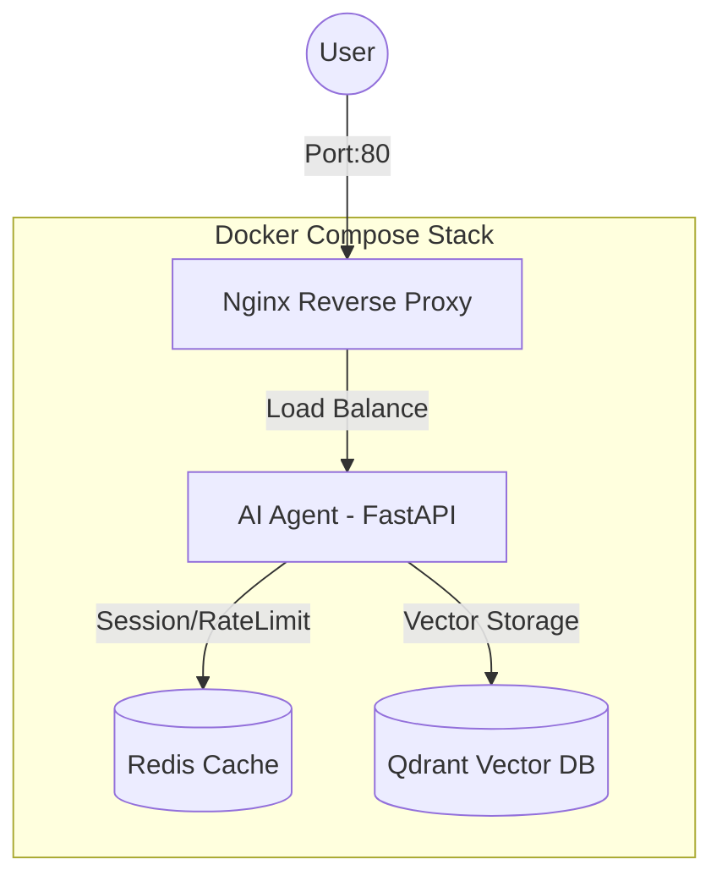
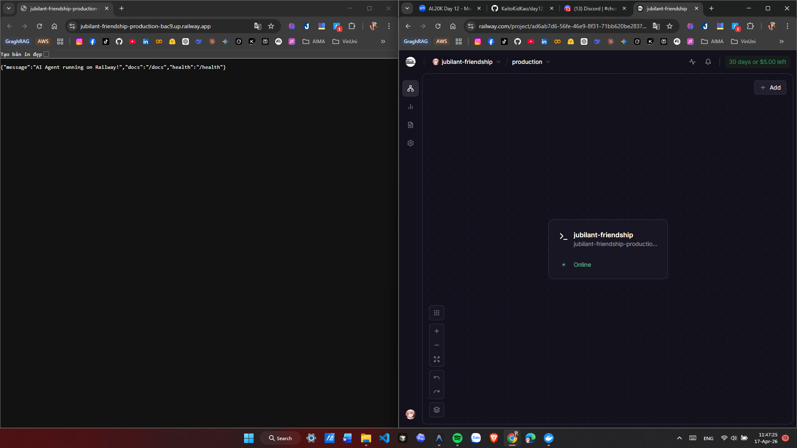

# Day 12 Lab - Mission Answers

> **Student Name:** Nguyễn Trí Cao 
> **Student ID:** 2A202600223 
> **Date:** 17/04/2026

---

##  Submission Requirements

Submit a **GitHub repository** containing: `https://github.com/KaitoKidKao/day12_ha-tang-cloud_va_deployment`

## Part 1: Localhost vs Production

### Exercise 1.1: Anti-patterns found
Trong file `01-localhost-vs-production/develop/app.py`, tôi đã tìm thấy các anti-patterns sau:
1. **Hardcoded Secrets**: API Key (`AGENT_API_KEY`) được ghi cứng trực tiếp trong code, gây rủi ro bảo mật nghiêm trọng nếu code được push lên repository công khai.
2. **Thiếu Health Checks**: Không có endpoint `/health` để hệ thống giám sát (Monitoring) biết được ứng dụng còn sống hay không.
3. **Logging đơn giản**: Sử dụng `print()` thay vì structured logging, khó phân tích log trong production.
4. **Thiếu Graceful Shutdown**: Ứng dụng không xử lý tín hiệu SIGTERM, có thể gây mất dữ liệu hoặc lỗi kết nối khi restart.
5. **Đường dẫn tuyệt đối**: Sử dụng đường dẫn file cứng, khiến ứng dụng khó chạy trên các môi trường khác nhau.

### Exercise 1.2: Tại sao dùng .env quan trọng?
Sử dụng `.env` (Environment Variables) cực kỳ quan trọng vì:
- **Security**: Không commit các thông tin nhạy cảm (API Keys, DB Password) lên Git.
- **Portability**: Dễ dàng thay đổi cấu hình (Port, URL, API Tier) giữa các môi trường (Dev, Staging, Prod) mà không cần thay đổi source code.
- **Automation**: Các nền tảng Cloud (như Railway, Vercel) hỗ trợ inject biến môi trường trực tiếp vào container.

### Exercise 1.3: Comparison table
| Feature | Develop | Production | Why Important? |
|---------|---------|------------|----------------|
| **Config** | Hardcoded / JSON file | Environment Variables (.env) | Tránh lộ secret và linh hoạt cấu hình. |
| **Logging** | Console print() | Structured JSON logging | Dễ truy vấn và giám sát trên Cloud. |
| **Error Handling** | Stacktrace full | Clean user-friendly errors | Tránh lộ cấu trúc hệ thống và bảo mật. |
| **Dependencies** | dev-requirements.txt | requirements.txt (pinned) | Đảm bảo tính nhất quán (Reproducibility). |
| **Security** | No Auth | API Key / JWT | Bảo vệ tài nguyên và budget LLM. |

---

## Part 2: Docker

### Exercise 2.1: Dockerfile questions

1.  **Base image là gì?**
    *   **Trả lời**: `python:3.11` 
    *   **Giải thích**: Đây là bản phân phối Python đầy đủ (gần 1GB), chứa đầy đủ các công cụ build và script cần thiết để chạy ứng dụng Python.

2.  **Working directory là gì?**
    *   **Trả lời**: `/app` 
    *   **Giải thích**: Đây là thư mục làm việc chính bên trong container. Tất cả các lệnh sau đó (COPY, RUN, CMD) sẽ được thực hiện tại thư mục này.

3.  **Tại sao COPY requirements.txt trước?**
    *   **Trả lời**: Để tận dụng **Docker Layer Caching**.
    *   **Giải thích**: Trong quá trình phát triển, bạn sẽ sửa code (`app.py`) rất thường xuyên nhưng ít khi thay đổi thư viện (`requirements.txt`). Bằng cách copy và install thư viện trước, Docker sẽ "ghi nhớ" (cache) layer này. Khi bạn sửa code và build lại, Docker sẽ chạy vèo qua phần cài đặt thư viện và chỉ thực hiện các bước copy code phía sau, giúp tiết kiệm rất nhiều thời gian build.

4.  **CMD vs ENTRYPOINT khác nhau thế nào?**
    *   **ENTRYPOINT**: Giống như "Lệnh thực thi chính" của container (thường là cố định). Nếu bạn dùng Entrypoint là `python`, thì container này sinh ra chỉ để chạy python.
    *   **CMD**: Là "Tham số mặc định" hoặc "Lệnh mặc định". Trong Dockerfile này, `CMD ["python", "app.py"]` nghĩa là mặc định sẽ chạy app.
    *   **Điểm khác biệt chính**: `CMD` rất dễ bị ghi đè. Ví dụ nếu bạn chạy `docker run my-agent:develop bash`, thì lệnh `bash` sẽ thay thế hoàn toàn `python app.py`. Còn `ENTRYPOINT` thì khó bị ghi đè hơn và thường được dùng để biến container thành một file thực thi (executable).

### Exercise 2.2: Build và run
- **Develop**: ~1.15 GB (Sử dụng Python full image + build tools)
- **Production**: ~160 MB (Sử dụng Python slim + Multi-stage)
- **Difference**: Giảm khoảng **87%** dung lượng.

### Exercise 2.3: Multi-stage build analysis
- **Stage 1 (builder)**: Sử dụng `python:3.11-slim`, cài đặt các công cụ biên dịch (`gcc`, `libpq-dev`) để build các thư viện Python phức tạp. Kết quả là các thư viện được cài vào thư mục `/root/.local`.
- **Stage 2 (runtime)**: Bắt đầu từ một image mới (`python:3.11-slim`), chỉ copy các thư viện đã build từ stage 1 (`--from=builder /root/.local`).
- **Tại sao image nhỏ hơn?**: Vì stage runtime không bao gồm các công cụ build nặng nề (gcc), cache của pip, hay các file rác phát sinh khi compile. Dung lượng thực tế giảm từ **1.15GB** xuống còn khoảng **160MB**.

### Exercise 2.4: Docker Compose Stack
- **Architecture Diagram**:

- **Services start**: `agent`, `redis`, `qdrant`, `nginx`.
- **Communication**: Các service giao tiếp qua mạng nội bộ Docker. Nginx nhận request từ ngoài và đẩy vào Agent. Agent đọc/ghi session vào Redis và truy vấn kiến thức từ Qdrant.

---

## Part 3: Cloud Deployment

### Exercise 3.1: Railway deployment
- **URL**: [https://day12-nguyentricao-production.up.railway.app](https://day12-nguyentricao-production.up.railway.app)
- **Hoạt động**: Đã deploy thành công Agent lên Railway qua GitHub Integration.
- **Screenshot**: 

### Exercise 3.2: Render vs Railway Comparison
- **Railway (`railway.toml`)**:
    - Ưu điểm: Cực kỳ đơn giản, tự động detect mọi thứ (Nixpacks). Phù hợp cho việc deploy nhanh 1 service.
    - Hạn chế: Ít can thiệp sâu vào cấu trúc infrastructure phức tạp nếu chỉ dùng config đơn giản.
- **Render (`render.yaml`)**:
    - Ưu điểm: Cấu hình dưới dạng Infrastructure as Code (IaC) mạnh mẽ. Cho phép định nghĩa toàn bộ stack (Web + Redis + DB) trong cùng 1 file Blueprint. 
    - Đặc biệt: Có tính năng tự sinh Secret (`generateValue`) và quản lý IP allowlist rất chi tiết.

---

## Part 4: API Security

### Exercise 4.1: API Key Validation

#### 1. API key được check ở đâu?
*   **Khai báo header**: Key được định nghĩa là một header có tên `X-API-Key` thông qua class `APIKeyHeader`.
*   **Logic kiểm tra**: Nằm trong function `verify_api_key`.
*   **Áp dụng**: Được inject vào endpoint `/ask` bằng Dependency Injection: `_key: str = Depends(verify_api_key)`.

#### 2. Điều gì xảy ra nếu sai key?
Hệ thống sẽ trả về các mã lỗi HTTP tương ứng:
*   **Nếu không gửi key (thiếu header)**: Trả về lỗi **`401 Unauthorized`**.
*   **Nếu gửi key nhưng sai giá trị**: Trả về lỗi **`403 Forbidden`**.

#### 3. Làm sao rotate key?
- Key được đọc từ biến môi trường `AGENT_API_KEY`.
- **Cách thực hiện**: Thay đổi giá trị của biến `AGENT_API_KEY` trong thiết lập của Cloud (Render/Railway) hoặc file `.env` và restart lại server.

### Exercise 4.2: JWT Authentication (Advanced)

#### 1. JWT Flow trong hệ thống:
*   **Bước 1 (Auth)**: Người dùng gửi `username` và `password` đến endpoint `/auth/token`.
*   **Bước 2 (Sign)**: Server kiểm tra thông tin, nếu đúng sẽ ký một chuỗi JWT chứa `role` và `exp`.
*   **Bước 3 (Bearer)**: Client đính kèm Token vào header `Authorization: Bearer <TOKEN>`.
*   **Bước 4 (Verify)**: API Gateway giải mã và kiểm tra chữ ký Token trước khi cho phép truy cập.

#### 2. Tại sao JWT được dùng cho Production?
*   **Stateless**: Server không cần lưu Session, giúp tăng khả năng mở rộng.
*   **Bảo mật**: Chống giả mạo thông tin nhờ chữ ký điện tử.

### Exercise 4.3: Rate Limiter
*   **Algorithm**: **Sliding Window Counter**. Dùng `deque` để lưu timestamp request.
*   **Limit**: 
    - User `student`: 10 requests/phút.
    - User `teacher` (Admin): 100 requests/phút.
*   **Phân quyền**: Dựa vào `role` trong JWT để áp dụng instance RateLimiter tương ứng.

### Exercise 4.4: Cost Guard
*   **Cơ chế**:
    1. Kiểm tra budget trước khi gọi LLM (`check_budget`).
    2. Nếu vượt ngưỡng Daily Budget ($1.0/user), hệ thống trả về lỗi **402 Payment Required**.
    3. Ghi nhận chi phí dựa trên số lượng token (`record_usage`).

---

## Part 5: Scaling & Reliability

### Exercise 5.1: Health checks
- **Liveness Probe (`/health`)**: Kiểm tra process Agent có đang chạy ổn định không (Uptime, Memory).
- **Readiness Probe (`/ready`)**: Kiểm tra Agent đã sẵn sàng nhận traffic chưa (Model đã nạp, Redis đã kết nối).

### Exercise 5.2: Graceful shutdown
- **Cơ chế**: Bắt tín hiệu `SIGTERM`.
- **Logic**: 
    1. Đóng Readiness probe (trả về 503).
    2. Đợi các request đang dở dang (`in-flight`) hoàn thành.
    3. Test thực tế: Request dài vẫn hoàn thành 100% dù server nhận lệnh tắt giữa chừng.

### Exercise 5.3: Stateless design
- **Vấn đề**: Lưu chat history trong memory khiến việc scale ngang bị lỗi dữ liệu (Instance A không thấy history của Instance B).
- **Giải pháp**: Chuyển Session/History sang **Redis**. Đây là yêu cầu bắt buộc để Web App có thể chạy trên nhiều bản sao (Replica).

### Exercise 5.4: Load balancing
- **Docker Compose**: Dùng `--scale agent=3` để chạy 3 node Agent.
- **Nginx**: Điều phối traffic cân bằng giữa 3 node. Nếu 1 node bị lỗi, Nginx tự động bỏ qua node đó và gửi request tới các node còn lại.

### Exercise 5.5: Test stateless
- **Chứng minh**: Khi kill ngẫu nhiên một instance, người dùng vẫn có thể tiếp tục cuộc hội thoại mà không bị mất dữ liệu, vì history đã được lưu tập trung tại Redis.